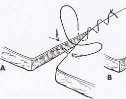

# Emilea Suplick
## _How to Suture_

Suturing is a vital skill for anyone who works in the medical field. From stitches cleaning up injuries to closing up surgeries, there is a suture pattern for every job. The simple continuous suture pattern is the perfect pattern for when time is limited.

WARNING: Take care when handling sharp needles.

## Materials Needed

- Needle drivers
- Suture scissors
- Rat tooth forceps
- A medium to practice on (such as a banana peel)
- Pre-loaded suture and needle
    > Any type of suture can be used when practicing. In real situations, the suture material will be chosen based on the kind of tissue and other complicating factors.

## Steps
 1.  Prepare the materials
        - Prepare a chosen medium by making sure it is spread evenly and has no folds
        - Create a slice in the medium to create the "lesion" that will be sutured closed
        - Take the needle with the attached suture out of its packaging and place it down next to the medium, where it will not be accidentally hit or dropped
 2.  Starting the pattern
        - Using the right hand right hand hand, take the needle drivers
        - Using the drivers, pick up the needle in the middle of the metal
        - Use the rat tooth forceps in your left hand to grab and stabilize the right side of the "lesion"
        - Drive the needle into the "skin" at an angle that is perpendicular to the "tissue" about 1/2 cm from the edge of the lesion
        - Push the needle through, curving it towards the inner edge of the tissue and push it out of the "tissue" about 1/2 cm deep
            > Repeat this process with the other side of tissue, entering from the inside of the lesion and exiting the top at a perpendicular angle
3.  Tying the first knot
    -  Pull the thread through the two sides of tissue, leaving 1 inch of suture free from the first entrance
    -  Release the needle from the needle drivers, instead grabbing the 1 inch of excess thread
    -  Holding the end of thread with the needle in the forceps, wrap this thread around the base of the needle drivers 3 times and pull both hands in opposite directions to bring the knot down to the tissue surface
    -  Repeat the process, instead wrapping the suture once around in the opposite direction and pulling the knot down to the tissue

 4.  Begin the continuous portion of the suture
        - Using the needle drivers in the right hand and stabilizing the tissue with the rat tooth forceps, take another bite of tissue from the right side of the lesion (about 1/2 cm below the original entrance point)
        -  Drive the needle through the tissue on the left side as described in step 2
 5.  Continue the pattern for the length of the lesion
     - continue taking new bites of tissue from the right side, spaced 1/2 cm from the one prior
      - follow the suture through to the left side each time
      - the pattern begins to look like a never-ending "Z" when continued down a lesion
 
 6. Check the integrity of the suture pattern
      - be sure that the edges of the lesion are lining up to each other correctly, avoiding any pursing of the tissue at the surface
    - check for any tears in the tissue from where the needle entered, being sure the tissue is stable and will hold
    - If the tissue has any of the above problems, try to release some of the pressure by giving more slack in the thread; otherwise, the sutures must be removed and redone for integrity of the pattern. Otherwise, continue to step 7
 7. Bring the suture to an end
       - Nearing the end of the lesion, leave space for one more bite on each side
 8. Finishing the suture
       - Take one last bite from each side, ending with the needle out of the left side as usual, but leave slack in the suture on the right side
       - use the slack on the right side to fold and create a tether to tie a surgeon's knot as in step 3
 
 9. Check the suture once more for pursing, folds, or tears

